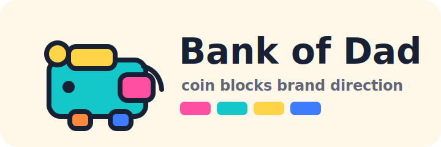

# Option A: Coin Blocks

Brand guide for the Bank of Dad brand exploration. This option is inspired by the Buddy Blocks reference in the spec without cloning it. It borrows the spirit of colorful, tactile learning pieces and adapts it to a family allowance ledger.

Sample names and balances in these mockups are documentation-only data. The production app should collect kids dynamically during first-run onboarding.

## Brand Concept

**Concept name:** Coin Blocks

**Positioning:** Bank of Dad becomes a small buildable money world. Saving snaps a coin into the tower, spending removes a tile, and the ledger feels like a set of friendly blocks that parents and kids can understand at a glance.

**Personality:**
- Playful, optimistic, tactile
- Parent-trustworthy without pretending to be a real bank
- Kid-friendly enough that Reagan and Ada can recognize their own accounts
- Fast and obvious for one-handed parent use

**Visual metaphor:** Coin tiles, piggy-bank blocks, rounded tabs, stamped allowance badges, and modular balance cards.

**Where it fits the product:** This is the best direction if the app should feel like a sibling to Buddy Blocks and part of a family of playful tools. It supports the core spec well because the ledger remains simple, but the account cards and transaction actions feel warmer than a standard finance app.

## Logo System

### Primary Logo Concept

Use a chunky "BOD" wordmark paired with a modular piggy-bank mark. The pig is not a detailed illustration; it is built from simple blocks:
- A rounded rectangle body
- One coin tile dropping into the top
- A small square snout
- A blocky "D" counter shape that echoes the wordmark

The logo should feel tactile and assembled, like pieces clicked together, but not use the exact Buddy Blocks shapes or palette placement.



### App Icon Concept

A single rounded square app icon with a blocky piggy-bank silhouette and one bright coin tile. Use high contrast because this will sit on a phone home screen.


### Logo Usage

- Use the full logo on onboarding and login.
- Use the icon mark only in the mobile app shell.
- Keep the mark on light warm backgrounds or solid ink.
- Avoid using every accent color in the logo at once inside small UI surfaces. Let the app icon carry the full playful palette, while screens use accents selectively.

## Color Palette

The palette is bright and modular, but functional UI states must keep accessible contrast. Use the vivid colors for tiles, avatars, badges, and accents. Use dark ink for most text and primary actions.

| Role | HEX | Usage |
| --- | --- | --- |
| Ink | `#182033` | Primary text, high-contrast button background |
| Bubblegum | `#FF4FA3` | Brand accent, badges, onboarding illustration |
| Pool Teal | `#14C7C9` | Secondary accent, avatar tiles |
| Block Yellow | `#FFD447` | Coin color, success decoration, selected states with ink text |
| Story Blue | `#3D7CFF` | Links, focus ring, secondary action |
| Citrus | `#FF8A3D` | Warm accent, activity markers |
| Wash | `#FFF7E8` | App background |
| Mint Wash | `#E9FBF8` | Positive empty states and soft panels |
| Surface | `#FFFFFF` | Cards, sheets, inputs |
| Line | `#D9D4C8` | Dividers and card edges |
| Muted Text | `#5F6678` | Secondary labels |
| Save | `#087F5B` | Save action, positive transaction amount |
| Spend | `#C73650` | Spend action, negative transaction amount |
| Error Wash | `#FFE8EE` | Error background |

Suggested PWA colors:
- `theme_color`: `#182033`
- `background_color`: `#FFF7E8`

## Typography

| Role | Font | Source / fallback |
| --- | --- | --- |
| Display | Fredoka 600-700 | Google Fonts or self-hosted; fallback `Arial Rounded MT Bold`, `system-ui`, sans-serif |
| Body/UI | Nunito Sans 500-800 | Google Fonts or self-hosted; fallback `ui-sans-serif`, `system-ui`, sans-serif |
| Numbers | Nunito Sans with tabular figures | Use `font-variant-numeric: tabular-nums` |

Usage notes:
- Use Fredoka for the app name, onboarding headline, kid names, and big balances.
- Use Nunito Sans for all labels, forms, transaction rows, and settings.
- Keep balance figures large, dark, and tabular. Playful does not mean wobbly money amounts.

## Iconography

Use simple rounded Lucide-style line icons inside small color-block containers. The container gives the brand its tactile shape; the icon stays familiar and legible.

Suggested icons:
- Home: `House`
- Kid/account: `CircleUserRound`
- Save: `PiggyBank` or `CirclePlus`
- Spend: `ShoppingBag` or `CircleMinus`
- Transaction/history: `ReceiptText`
- Lock/login: `LockKeyhole`
- Settings: `Settings`
- Interest: `BadgePercent`

Icon treatment:
- 2px rounded strokes
- Ink icons on yellow or mint tiles
- White icons only on dark ink, save, or spend backgrounds
- Avoid tiny multicolor icons inside transaction rows; use a single state color per row

## UI Component Language

### Cards

- Modular tile cards with `8px` radius, strong but soft outlines, and a 3-4px offset color shadow.
- Kid cards can have a colored tab on the left edge and a circular avatar tile.
- Use a stable card height on the home screen so balances do not shift the layout.

### Buttons

- Large thumb-friendly buttons.
- Primary button: ink background, white text, optional coin icon.
- Save button: save green with white text.
- Spend button: spend red with white text.
- Secondary buttons: white surface, ink text, 2px ink or line border.
- Icon-only buttons need visible accessible labels/tooltips in the implementation.

### Inputs

- White surfaces, 2px line border, `8px` radius.
- Focus ring in Story Blue.
- Validation messages use Spend with a soft Error Wash background.

### Transaction Rows

- Rows look like stacked block strips.
- Left side: date tile.
- Center: description and type badge.
- Right side: signed amount and running balance.
- Save/interest rows use green amount text; spend rows use red amount text.

### Balance Display

- Big balance in a chunky tile with the kid name above it.
- Include small plain-language helper text: "Current balance" or "After last transaction."
- Use tabular numerals.

### Empty States

- Use a small coin tile illustration and a short friendly line.
- Example: "No transactions yet. Add a save or spend to start the ledger."

### Error States

- Keep copy direct and kind.
- Example login error: "That password did not work. Try again."
- Do not use harsh warning styling for routine validation.

## Key Screen Mockups

These are low-fidelity mobile wireframes for layout and tone, not implementation code.

### First-Run Onboarding

```txt
+------------------------------------------------+
| [block pig logo]                               |
| Bank of Dad                                    |
| Set up your family bank.                       |
|                                                |
| [Step badge 1] Parent password                 |
| Password                         [          ]  |
| Confirm password                 [          ]  |
|                                                |
| [Step badge 2] Add kids                        |
| + Reagan                         [$ 0.00   ]  |
| + Ada                            [$ 0.00   ]  |
| [ + Add another kid ]                          |
|                                                |
| [ Finish setup ]                               |
+------------------------------------------------+
```

Notes:
- Step badges look like snapped-on stickers.
- Starting balances are optional; if used, they should become explicit starting-balance transactions.
- The finish button should remain disabled until password validation passes and at least one kid exists.

### Login

```txt
+------------------------------------------------+
|                 [pig coin icon]                |
|                 Bank of Dad                    |
|                                                |
| Parent password                                |
| [                                          ]   |
|                                                |
| [ Unlock family bank ]                         |
|                                                |
| That password did not work. Try again.         |
+------------------------------------------------+
```

Notes:
- Use a calm, centered login card.
- Keep the password field and submit button large enough for phone use.

### Home Dashboard

```txt
+------------------------------------------------+
| Bank of Dad                         [gear]     |
| Today                                                   |
|                                                |
| +--------------------------------------------+ |
| | [R tile] Reagan                       $42.75| |
| | Saved this month: $8.50              [>]    | |
| +--------------------------------------------+ |
|                                                |
| +--------------------------------------------+ |
| | [A tile] Ada                          $18.20| |
| | Last activity: Ice cream              [>]    | |
| +--------------------------------------------+ |
+------------------------------------------------+
```

Notes:
- Reagan and Ada are sample data only.
- Kid cards should be tappable from edge to edge.
- Optional metadata can be playful, but the current balance must stay the visual priority.

### Kid Account

```txt
+------------------------------------------------+
| [<] Reagan                                     |
|                                                |
| Current balance                                |
| $42.75                                         |
|                                                |
| [ + Save ]             [ - Spend ]             |
|                                                |
| History                                        |
| Jun 30  Lemonade stand       +$8.50   $42.75   |
| Jun 28  Book fair            -$6.25   $34.25   |
| Jun 01  Monthly interest     +$0.40   $40.50   |
+------------------------------------------------+
```

Notes:
- Save and Spend are equal-level actions because both are common.
- Monthly interest appears in history like any other explicit transaction.

### Save / Spend Transaction Sheet

```txt
+------------------------------------------------+
| Reagan                                         |
| +--------------------------------------------+ |
| | Save money                                 | |
| | Amount                         [$       ]  | |
| | Description                    [        ]  | |
| | Date                           [Today  ]  | |
| |                                            | |
| | [ Cancel ]          [ Add save ]           | |
| +--------------------------------------------+ |
|                                                |
| Spend mode swaps green for red and changes     |
| the submit label to "Add spend".               |
+------------------------------------------------+
```

Notes:
- Use a bottom sheet on mobile if the route architecture supports it.
- If it is a full page, preserve the same compact form rhythm.
- Validate positive amount and keep the transaction type derived from the button tapped.

## Accessibility Notes

- Do not rely on color alone for transaction type. Use signed amounts, text labels, and icons.
- Use ink text on yellow/orange accents; avoid white text on bright yellow.
- Minimum touch target: 44px by 44px.
- Use `aria-live` for save/spend success confirmations.
- Preserve semantic form labels; placeholders are not labels.
- Use `prefers-reduced-motion` if tactile snap animations are added later.
- Keep the login error message in text, not only a red border.

## Implementation Notes

Suggested CSS variables:

```css
:root {
  --color-ink: #182033;
  --color-brand-pink: #FF4FA3;
  --color-brand-teal: #14C7C9;
  --color-brand-yellow: #FFD447;
  --color-brand-blue: #3D7CFF;
  --color-brand-orange: #FF8A3D;
  --color-bg: #FFF7E8;
  --color-bg-positive: #E9FBF8;
  --color-surface: #FFFFFF;
  --color-line: #D9D4C8;
  --color-muted: #5F6678;
  --color-save: #087F5B;
  --color-spend: #C73650;
  --radius-card: 8px;
  --radius-control: 8px;
  --shadow-block: 0 4px 0 #D9D4C8;
}
```

Responsive behavior:
- Design mobile first around a 360px wide viewport.
- Use one-column kid cards on mobile.
- On wider screens, keep the app shell narrow, roughly 420-520px, so it still feels like a focused phone utility.
- Keep action buttons sticky or near the top of a kid account screen; parents should not scroll to add a transaction.

Asset notes:
- Concept SVGs live in `public/brand/options/option-a-logo.svg` and `public/brand/options/option-a-app-icon.svg`.
- Production icons should be regenerated after the final brand choice so the PWA manifest has proper maskable icon sizes.
- The playful block shadow is a style token; use it consistently and sparingly.
