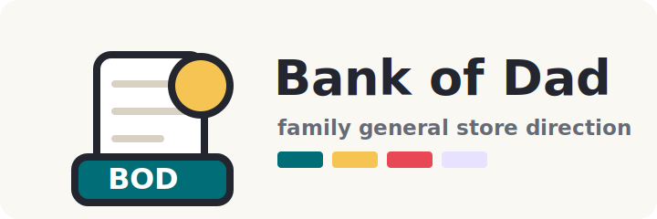

# Option C: Family General Store

Brand guide for the Bank of Dad brand exploration. This is the Codex-choice direction: a warm household counter, receipt book, and tiny general store system.

Sample names and balances in these mockups are documentation-only data. The production app should collect kids dynamically during first-run onboarding.

## Brand Concept

**Concept name:** Family General Store

**Positioning:** Bank of Dad becomes the little account counter for the household. It is not a toy block world and not a formal bank. It feels like a family-run store ledger where chores, savings, and small purchases are recorded clearly.

**Why this fits:** The spec describes a private family-only chore/spending ledger that parents update manually. A general-store metaphor makes that feel natural: parents are the counter staff, kids have account tabs, every save/spend is a receipt entry, and monthly interest is a stamped ledger item. It is warmer than Option B and more grown-up than Option A.

**Personality:**
- Warm, practical, and homey
- Slightly nostalgic without being old-fashioned
- Clear about transactions and balances
- Friendly for kids, efficient for parents

**Visual metaphor:** Counter tabs, receipt strips, shelf labels, stamped totals, account tickets, and a simple cash-drawer mark.

**Where it fits the product:** This option is strongest if the app should feel personal and family-owned rather than app-store-finance or classroom-playful. It makes the ledger feel tangible while preserving the spec's need for clean, auditable transaction history.

## Logo System

### Primary Logo Concept

Use a simple "Bank of Dad" wordmark beside a receipt-tab mark. The mark combines:
- A small receipt strip
- A cash-drawer line
- A coin circle
- A `BOD` counter label

The logo should feel like the sign on a tiny household account counter.



### App Icon Concept

A square icon with a receipt tab and coin over a strong teal field. The icon should read as "small ledger" at phone size without becoming a banking/vault symbol.


### Logo Usage

- Use the full logo on onboarding.
- Use the receipt-tab mark in the mobile app header.
- Use the coin only as an accent, not as repeated decoration.
- Keep the wordmark on clean light surfaces so it feels crisp rather than rustic.

## Color Palette

The palette avoids looking like a beige notebook by pairing warm paper with clear teal, tomato, mustard, lavender, and graphite.

| Role | HEX | Usage |
| --- | --- | --- |
| Graphite | `#23262F` | Primary text, headers |
| Counter Teal | `#006D77` | Brand color, primary button |
| Fresh Mint | `#DDF7F1` | Positive soft background |
| Tomato | `#E84855` | Spend action, errors |
| Mustard | `#F6C453` | Coin accent, highlights |
| Lavender Ticket | `#E7E2FF` | Kid avatar/ticket accent |
| Paper | `#FAF8F3` | App background |
| Surface | `#FFFFFF` | Cards and sheets |
| Ledger Line | `#D8D1C4` | Rules, receipt dividers |
| Muted Text | `#646B76` | Metadata and helper copy |
| Save | `#087F5B` | Save action and positive amounts |
| Spend | `#C73650` | Spend action and negative amounts |
| Focus | `#245DFF` | Focus ring |
| Error Wash | `#FFE8EC` | Error background |

Suggested PWA colors:
- `theme_color`: `#006D77`
- `background_color`: `#FAF8F3`

## Typography

| Role | Font | Source / fallback |
| --- | --- | --- |
| Display | Fraunces 600-700 | Google Fonts or self-hosted; fallback Georgia, serif |
| Body/UI | Atkinson Hyperlegible 400-700 | Google Fonts or self-hosted; fallback `system-ui`, sans-serif |
| Receipt numbers | Space Mono 400-700 | Google Fonts or fallback `ui-monospace`, monospace |

Usage notes:
- Use Fraunces for the app name, onboarding headline, and section headings only.
- Use Atkinson Hyperlegible for labels, forms, buttons, and transaction descriptions.
- Use Space Mono sparingly for amounts and running totals.
- Keep headings compact. The product should feel like a tool, not a marketing page.

## Iconography

Use simple line icons with a receipt-counter flavor. Icons can sit in small ticket tabs or square action chips.

Suggested icons:
- Home: `Store` or `House`
- Kid/account: `Badge`
- Save: `CirclePlus` or `PiggyBank`
- Spend: `ShoppingBasket` or `CircleMinus`
- Transaction/history: `ReceiptText`
- Lock/login: `KeyRound`
- Settings: `Settings`
- Interest: `BadgePercent`

Icon treatment:
- 2px line icons in Graphite or white on Counter Teal.
- Action icons can use save/spend colors.
- Receipt/history icons can use muted text so transaction amounts remain primary.

## UI Component Language

### Cards

- Account cards are "tabs" or "tickets" with `8px` radius, a left accent strip, and light ledger lines.
- Surfaces stay mostly flat. Use texture through borders and dividers, not visual noise.
- Kid initials can sit in small ticket labels.

### Buttons

- Primary button: Counter Teal with white text.
- Save button: Save green with white text.
- Spend button: Spend red with white text.
- Secondary button: white surface with Graphite border.
- Tertiary actions can look like underlined receipt links.

### Inputs

- Clean white fields with subtle ledger-line borders.
- Labels sit above fields, like form entries on a receipt pad.
- Amount input can use a larger monospace value.

### Transaction Rows

- Rows resemble receipt lines: date, description, signed amount, balance after.
- Use dotted or solid ledger rules between rows.
- Transaction type appears as a small stamped label: Save, Spend, Interest.

### Balance Display

- Balance appears as a "tab total" near the top of the account screen.
- Use a small label like "Open tab" or "Current balance"; avoid making it sound like a real bank account.
- Amounts use tabular monospace.

### Empty States

- Use receipt language.
- Example: "No entries yet. Add a save or spend to open the tab."

### Error States

- Use a red left rule and plain copy.
- Example: "Enter an amount greater than $0.00."

## Key Screen Mockups

These are low-fidelity mobile wireframes for layout and tone, not implementation code.

### First-Run Onboarding

```txt
+------------------------------------------------+
| [receipt tab mark] Bank of Dad                 |
| Set up your family bank.                       |
|                                                |
| Counter setup                                  |
|                                                |
| Parent password                                |
| Password                         [          ]  |
| Confirm password                 [          ]  |
|                                                |
| Kids with tabs                                 |
| Reagan                          [$0.00] [x]   |
| Ada                             [$0.00] [x]   |
| [ + Add another kid ]                          |
|                                                |
| [ Open the family ledger ]                     |
+------------------------------------------------+
```

Notes:
- "Counter setup" gives the flow a warm concept without adding extra steps.
- Starting balances, if included, must be saved as explicit starting-balance transactions.
- Keep onboarding clear enough for other families reusing the public repo.

### Login

```txt
+------------------------------------------------+
|              [receipt tab mark]                |
|              Bank of Dad                       |
|              Family ledger                     |
|                                                |
| Parent password                                |
| [                                          ]   |
|                                                |
| [ Open ledger ]                                |
|                                                |
| That password did not work. Try again.         |
+------------------------------------------------+
```

Notes:
- The login screen should feel private but not heavy.
- Avoid "secure vault" language here; this direction is about household trust and clarity.

### Home Dashboard

```txt
+------------------------------------------------+
| Bank of Dad                         [settings] |
| Family tabs                                    |
|                                                |
| +--------------------------------------------+ |
| | [R] Reagan                         $42.75  | |
| | Last entry: Lemonade stand              >  | |
| +--------------------------------------------+ |
|                                                |
| +--------------------------------------------+ |
| | [A] Ada                            $18.20  | |
| | Last entry: Ice cream                   >  | |
| +--------------------------------------------+ |
+------------------------------------------------+
```

Notes:
- Reagan and Ada are sample data only.
- "Family tabs" reinforces the general-store concept without confusing the ledger model.
- Balances still dominate each card.

### Kid Account

```txt
+------------------------------------------------+
| < Family tabs                                  |
| Reagan                                         |
|                                                |
| OPEN TAB                                       |
| $42.75                                         |
|                                                |
| [ + Save ]                      [ - Spend ]    |
|                                                |
| Receipt entries                                |
| Jun 30 | Lemonade stand     | +$8.50 | $42.75 |
| Jun 28 | Book fair          | -$6.25 | $34.25 |
| Jun 01 | Monthly interest   | +$0.40 | $40.50 |
+------------------------------------------------+
```

Notes:
- "Open tab" works as a metaphor for current balance, but the code/data model still uses "balance."
- Most recent transactions appear first.
- Interest reads as one receipt entry, consistent with the spec.

### Save / Spend Transaction Screen

```txt
+------------------------------------------------+
| New save entry                                 |
| Reagan                                         |
|                                                |
| Amount                                         |
| [$                                      ]      |
|                                                |
| Description                                    |
| [ Lemonade stand                        ]      |
|                                                |
| Date                                           |
| [ Today                                  ]     |
|                                                |
| [ Cancel ]                     [ Add entry ]   |
|                                                |
| Spend mode uses "New spend entry" and the      |
| spend color while preserving the same form.    |
+------------------------------------------------+
```

Notes:
- A dedicated route may feel especially natural in this direction, like writing a new receipt.
- A bottom sheet is still fine on mobile if implementation favors fewer routes.
- Keep amount validation immediate and friendly.

## Accessibility Notes

- Do not use receipt-like low contrast. Ledger lines can be subtle, but text must remain strong.
- Use signed amounts and labels in addition to save/spend colors.
- Minimum touch target: 44px by 44px.
- Use clear form labels and associate errors with fields.
- Avoid decorative paper textures that reduce legibility.
- Preserve a logical reading order in receipt rows.
- Use `prefers-reduced-motion` if stamp or receipt-slide animations are added later.

## Implementation Notes

Suggested CSS variables:

```css
:root {
  --color-ink: #23262F;
  --color-brand: #006D77;
  --color-mint: #DDF7F1;
  --color-tomato: #E84855;
  --color-mustard: #F6C453;
  --color-lavender: #E7E2FF;
  --color-bg: #FAF8F3;
  --color-surface: #FFFFFF;
  --color-line: #D8D1C4;
  --color-muted: #646B76;
  --color-save: #087F5B;
  --color-spend: #C73650;
  --color-focus: #245DFF;
  --radius-card: 8px;
  --radius-control: 8px;
  --shadow-card: 0 1px 0 rgba(35, 38, 47, 0.08);
}
```

Responsive behavior:
- Mobile first, app shell capped around 480-520px on larger screens.
- Home uses one-column account tabs.
- Transaction rows should reflow from four columns to stacked metadata under 380px wide.
- Keep monthly interest in settings or mobile menu, not as a home-screen CTA.

Asset notes:
- Concept SVGs live in `public/brand/options/option-c-logo.svg` and `public/brand/options/option-c-app-icon.svg`.
- The receipt-tab mark can become the PWA maskable icon after final selection.
- This direction can be implemented with plain CSS, subtle borders, and a small icon set. It does not require illustration assets.
